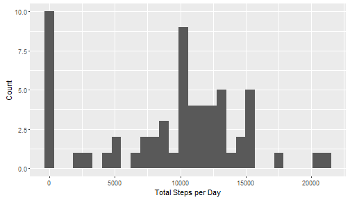
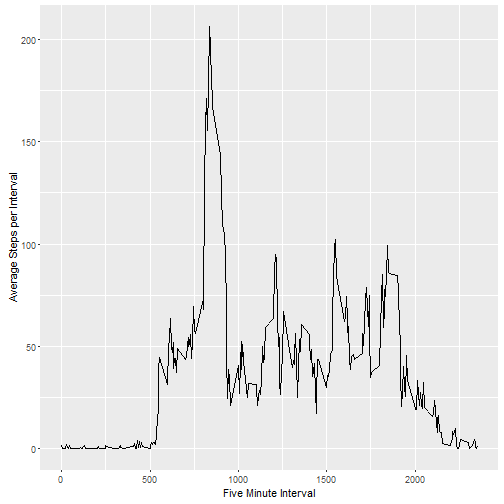
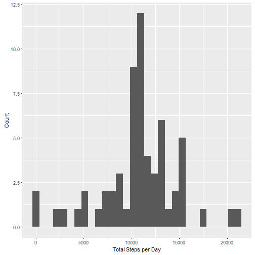
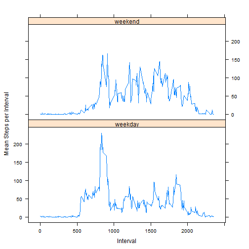

```r
require(dplyr)
require(ggplot2)
require(lubridate)
require(lattice)
require(knitr)
require(markdown)
```

####Loading and preprocessing the data  

```r
projdata <- read.csv("activity.csv")
projdata <- as.tbl(projdata)
```
No preprocessing was needed.  

####What is mean total number of steps taken per day?  

```r
tot_steps_day <- projdata %>% group_by(date) %>% summarize(TotSteps = sum(steps, na.rm=TRUE))
```

```r
ggplot(data=tot_steps_day, aes(tot_steps_day$TotSteps)) +labs(x="Total Steps per Day", y="Count")+ geom_histogram()
```

```
## `stat_bin()` using `bins = 30`. Pick better value with `binwidth`.
```




```r
meantot <- mean(tot_steps_day$TotSteps)
mediantot <- median(tot_steps_day$TotSteps)
```

The mean steps per day is 9354.2295082.  
The median steps per day is 10395.  
 

####What is the average daily activity pattern?  

```r
activity <- projdata %>% group_by(interval) %>% summarize(MeanSteps = mean(steps, na.rm=TRUE))

plot2 <- ggplot(data=activity, aes(y=activity$MeanSteps, x=activity$interval)) + labs(x="Five Minute Interval", y="Average Steps per Interval")+ geom_line()

plot2
```



```r
max_steps <- activity[which.max(activity$MeanSteps),1]
```
  
The interval 835 contains the maximum number of steps on average.  

####Imputing missing values  

```r
missing <- sum(is.na(projdata$steps))

projdata_full <- projdata %>% filter(!is.na(steps))
projdata_m <- projdata %>% filter(is.na(steps))
projdata_imp <- left_join(projdata_m, activity, by="interval") %>% select(date,interval, steps=MeanSteps)

projdata_final <- rbind(projdata_full, projdata_imp)

projdata_final_gg <- projdata_final %>% group_by(date) %>% summarize(TotSteps = sum(steps))

plot3 <- ggplot(data=projdata_final_gg, aes(projdata_final_gg$TotSteps)) +labs(x="Total Steps per Day", y="Count")+ geom_histogram()
plot3
```

```
## `stat_bin()` using `bins = 30`. Pick better value with `binwidth`.
```



```r
meanimp <- mean(projdata_final_gg$TotSteps)
medianimp <- median(projdata_final_gg$TotSteps)
```

There are 2304 rows with missing values.  
The mean steps per day in the imputed data is 1.0766189 &times; 10<sup>4</sup>.  
The median steps per day in the imputed data is 1.0766189 &times; 10<sup>4</sup>.  
Imputing the average steps at each interval for missing data increased both the mean and the median.  

####Are there differences in activity patterns between weekdays and weekends?  


```r
daysdata <- weekdays(parse_date_time(projdata_final$date, "Y-m-d"))
projdata_days <- cbind(projdata_final,daysdata)
projdata_days <- projdata_days %>% mutate(weekday = ifelse(projdata_days$daysdata %in% c("Saturday", "Sunday"), "weekend", "weekday"))

projdata_days_gg <- projdata_days %>% group_by(interval, weekday) %>% summarize(MeanSteps = mean(steps)) 

plot4 <- xyplot(data=projdata_days_gg, MeanSteps~interval|weekday, type ='l', auto.key = T,layout=c(1,2), xlab="Interval",ylab="Mean Steps per Interval")
plot4
```


